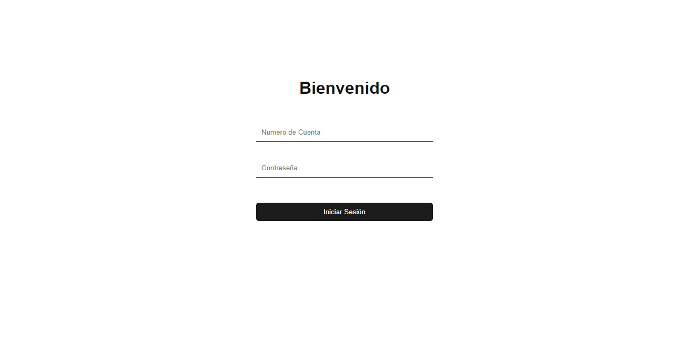

# Cajero Automático - DEVF

Esta es mi práctica del desarrollo de un cajero automático para el proyecto correspondiente a la KATA 2 de Javascript.

El cajero cuenta con un documento JSON correspondiente a la BD (no es actualizable aún, ya que dicho documento .json es estático).

Nos permite entrar con un número de cuenta y contraseña y una vez dentro colocamos el monto a depositar o retirar.

Para ello nuestro proyecto cuenta con dos archivos HTML correspondientes a cada interface (ISesion y Profile), y sus JS y CSS correspondientes.

Happy Coding! 👾🖖

Link Página: [ayrtonbolwal-mycajerodevf.netlify.app](https://ayrtonbolwal-mycajerodevf.netlify.app/)
